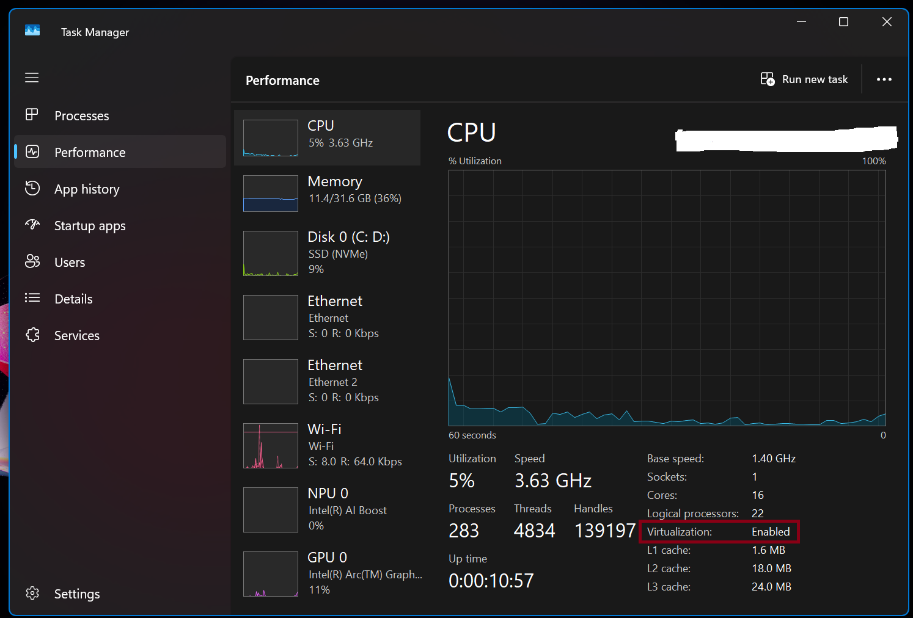

# Enabling Virtualization and Installing VirtualBox on Windows 11

## Project Overview
This guide covers the prerequisites for building a cybersecurity home lab. We will enable hardware virtualization in Windows, verify it, and install Oracle VM VirtualBox to host our guest operating systems (Kali Linux and Windows 10).

## Step 1: Verify & Enable Hardware Virtualization

Before installing VirtualBox, your computer's CPU must have virtualization enabled in the system BIOS/UEFI.

### 1. Check Current Status
1. Press `Ctrl + Shift + Esc` to open **Task Manager**.
2. Click on the **Performance** tab, then select **CPU**.
3. Look for **Virtualization** in the bottom right details panel. 
   * *If it says **Enabled**, you can skip to Step 2.*
   * *If it says **Disabled**, proceed below.*

### 2. Enable via Windows Features
1. Press the Windows Key, type `Turn Windows features on or off`, and press Enter.
2. Ensure **Virtual Machine Platform** and **Windows Hypervisor Platform** are checked if you plan to run nested virtualization, or leave them unchecked if you face VirtualBox conflicts.

**Note on Hyper-V:** VirtualBox can sometimes clash with Windows Hyper-V. If you experience performance issues or "VT-x is not available" errors later, you may need to disable Hyper-V in this menu.

### 3. If Disabled, Enable via BIOS/UEFI 
1. Restart your PC and tap the BIOS key repeatedly (usually `F2`, `F10`, `F12`, or `Del`).
2. Navigate to the **Advanced**, **Processor**, or **Configuration** tab.
3. Locate the setting named **Intel Virtualization Technology (VT-x)** or **AMD-V / SVM Mode**.
4. Change the setting to **Enabled**.
5. Save changes and exit (usually `F10`).

## Step 2: Download and Install VirtualBox

### 1. Download the Installer
1. Navigate to the official [VirtualBox Downloads page](https://www.virtualbox.org/wiki/Downloads).
2. Download the **Windows hosts** package.
3. **Crucial:** Download the **VirtualBox Extension Pack** found on the same page (this adds support for USB 2.0/3.0 devices, disk encryption, and RDP).

### 2. Installation Process
1. Run the VirtualBox executable as an Administrator.
2. Accept the default installation path and features.
3. *Warning:* The installer will briefly reset your network connection. Click **Yes** to proceed.
4. Complete the wizard and launch VirtualBox.

### 3. Install the Extension Pack
1. Open VirtualBox.
2. Go to **File** > **Tools** > **Extension Pack Manager** (or double-click the downloaded Extension Pack file).
3. Click **Install**, scroll to the bottom of the license agreement, and click **I Agree**.

## Step 3: Verification

To verify everything is working smoothly:
1. Open VirtualBox.
2. Click **New** to create a mock virtual machine.
3. In the **Version** dropdown, verify that you can see **64-bit** operating system options (e.g., *Ubuntu (64-bit)*, *Windows 10 (64-bit)*).

**Troubleshooting:** If you only see 32-bit options, it means hardware virtualization is either disabled in your BIOS or Hyper-V is blocking VirtualBox from accessing the CPU features.

---

## Next Steps
Now that your hypervisor is ready, the next step is provisioning the lab environment:
* [Link to Kali Linux Installation Guide](./kali-installation.md)
* [Link to Windows 10 Target Lab Guide](./win10-setup.md)
